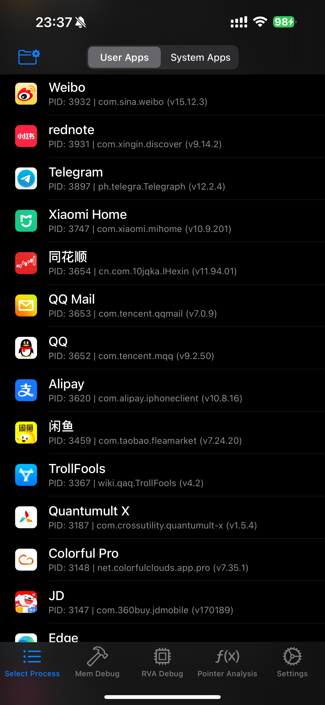
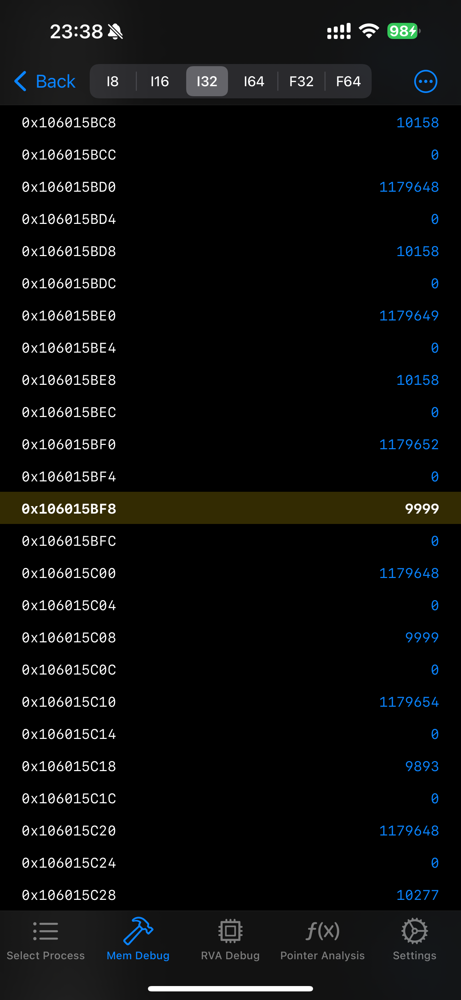
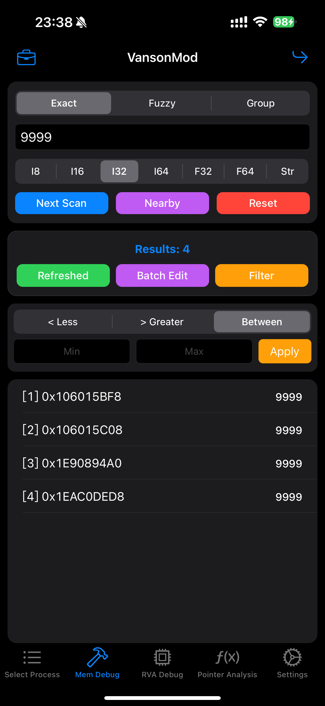
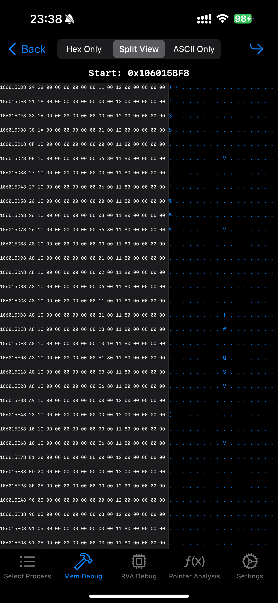
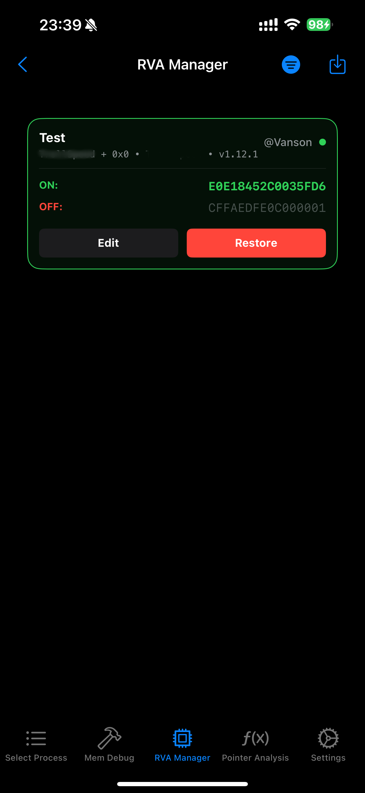
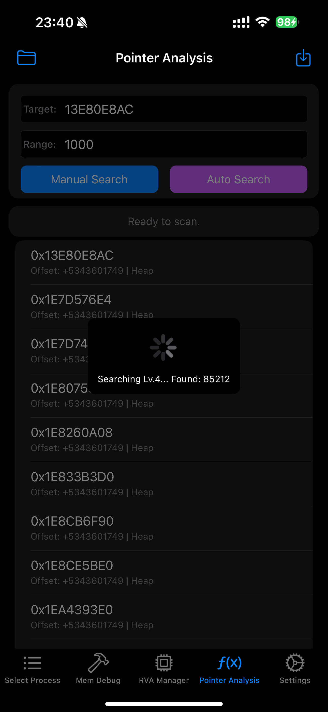
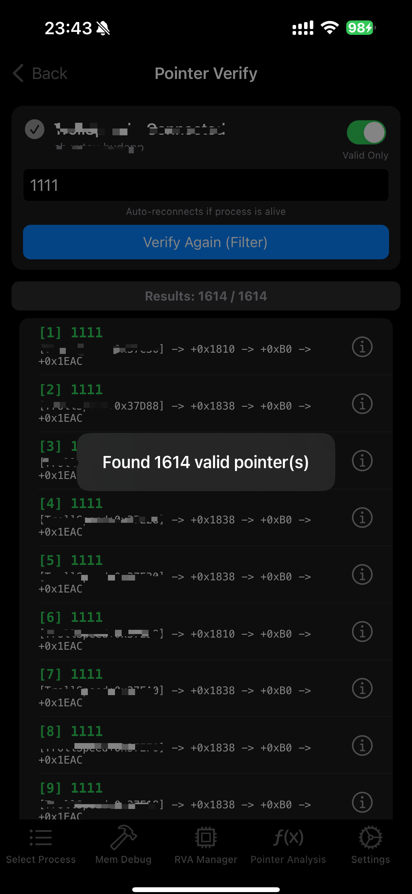
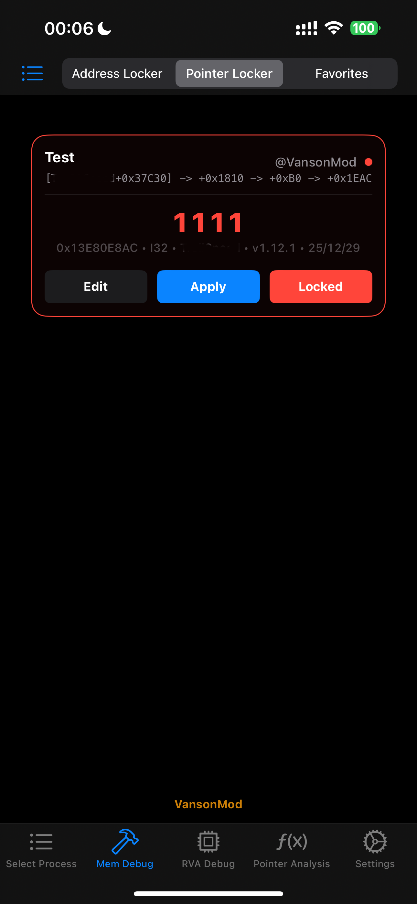

# VansonMod

<p align="center">
  
</p>

**iOS-Memory-Editor, Pointer-Analyse, RVA-Patcher und Prozessmanager für TrollStore (Jailbreak optional). Unterstützt Hex-Bearbeitung, Wertesuche und Backup/Wiederherstellung**

[English](./README.md) | [简体中文](./README_CN.md) | [繁體中文](./README_TW.md) | [العربية](./README_AR.md) | **Deutsch** | [Español](./README_ES.md) | [Français](./README_FR.md) | [日本語](./README_JA.md) | [한국어](./README_KO.md) | [Português](./README_PT.md) | [Русский](./README_RU.md) | [ไทย](./README_TH.md) | [Tiếng Việt](./README_VI.md)


> [](https://t.me/VansonMod)

---

## Einführung

**VansonMod** ist ein eigenständiges iOS-Debugging-Tool für die **TrollStore**-Umgebung. Es arbeitet extern und ist nicht auf klassische Tweak-Injektion angewiesen. Dadurch bleiben viele typische Workflows auch auf nicht gejailbreakten Geräten verfügbar: Prozessauswahl, Speicher-Suche, Speicher-Browser, Pointer-Analyse und -Verifikation, Signaturanalyse, Skripte und Backup-Verwaltung.

Auf gejailbreakten Geräten bietet VansonMod zusätzlich tiefere Code-Workflows wie **RVA Patch** und **Hardware-Watchpoint-Monitoring**. Die aktuelle Version ist längst mehr als nur ein Memory-Scanner und entwickelt sich zu einer umfassenderen iOS-Debugging-Workstation.

## Kompatibilität

- **Unter TrollStore / ohne Jailbreak verfügbar**: Prozessauswahl, Memory-Search, Nearby-Search, Ergebnisfilter, Speicher-Browser, Hex-Editor, Pointer-Analyse und -Verifikation, Signaturanalyse, Skript-Tools, Backup-Verwaltung sowie Theme-/Sprach-/Icon-Einstellungen.
- **Funktionen mit Abhängigkeit vom target task port**: einige Runtime-Funktionen benötigen erfolgreichen Zugriff auf den task port des Zielprozesses; das Verhalten kann je nach Umgebung und App-Zustand variieren.
- **Für Jailbreak empfohlen oder darauf beschränkt**: `RVA Patch`, `RVA-Record-Management` und `Hardware-Watchpoints` sind vor allem für Umgebungen wie **Dopamine / palera1n** gedacht.
- **Warum**: auf Geräten ohne Jailbreak erzwingt **AMFI** strikte Code-Signatur-Prüfungen. Direkte Änderungen am ausführbaren Segment (`__TEXT`) führen normalerweise sofort zum Absturz der Ziel-App.

## Sprachunterstützung

- Integrierte Sprachen: 简体中文, 繁體中文, English, العربية, Deutsch, Español, Français, 日本語, 한국어, Português, Русский, ไทย, Tiếng Việt.

## Navigation

- **App Selection**: laufende Prozesse, alle installierten Apps oder Systemprozesse anzeigen; Suche per Name / Bundle ID / PID; direkt anhängen, öffnen, beenden, sichern oder Code-Änderungen prüfen.
- **Memory Debug**: exakte, fuzzy, gruppierte und Nearby-Suche, Ergebnisfilter, Batch-Bearbeitung sowie Sprung in Wert- oder Hex-Ansicht.
- **RVA Debug**: Patches nach Modul und Offset anwenden und RVA-Einträge verwalten.
- **Toolbox**: Memory-Locks, Favoriten, Pointer, RVA, Signaturen, Verifier-Dateien und Skripte zentral verwalten.
- **Settings**: Theme, Sprache, Icons, Tab-Reihenfolge, Suchbereiche, Float-Toleranz, Ergebnislimit und Update-Checks konfigurieren; Tabs lassen sich auch per langem Druck auf das untere Menü schnell umsortieren.

## Highlights

- **Prozess- und App-Verwaltung**: `Running / All / System`-Ansichten, lokalisierte App-Namen, Versionsanzeige, Favoriten, PID-/Bundle-ID-Kopie, schneller App-Start und Prozessbeendigung.
- **Speichersuche und Batch-Bearbeitung**: exakte, fuzzy, Gruppen-, Bereichs- und Nearby-Suche sowie größer/kleiner/zwischen-Filter, feste Werte, inkrementelle Bearbeitung, Massen-Lock und Massen-Favoriten.
- **Speicher-Browser und Hex-Editor**: Adresssprung, Auto-Refresh, String-Ansicht, Massenkopie von Adressen; der Hex-Editor unterstützt `Hex / Split / Text`, Zeilenbearbeitung und Offset-Sprünge.
- **Pointer-Analyse und Verifikation**: manuelle oder automatische Pointer-Ketten, statisch / dynamisch / alle / Backtrack, Echtzeit-Verifikation, Snapshot-Vergleich und Import/Export von Verifier-Dateien.
- **Signaturen und Skripte**: Signaturanalyse ab beliebiger Adresse, Modulbereich, globale Suche und Smart Mask; integrierte JavaScript-Laufzeit mit Anleitungen und Beispielen direkt in VM.
- **RVA, Watchpoints und Prozess-Audit**: Modulauswahl, Offset-Patches, ARM64-Presets und RVA-Verwaltung; mit Jailbreak auch Hardware-Watchpoints. Das Prozess-Audit zeigt, welche Code-Positionen oder RVA-Werte sich vor und nach dem Start der Ziel-App geändert haben.
- **Erlebnis und Einstellungen**: Theme-Wechsel, Sprachwechsel, Icon-Wechsel, Tab-Sortierung, Fuzzy-Suchbereich, Lock-Intervall, Ruhezustand verhindern sowie Unterstützung für iPad Split View, Querformat und Stage Manager.

## Screenshots

| <div align="center"></div> | <div align="center"></div> | <div align="center"></div> | <div align="center"></div> |
| :------------------------------------------------------------------------------------------------: | :--------------------------------------------------------------------------------------------------: | :------------------------------------------------------------------------------------------------: | :---------------------------------------------------------------------------------------------------: |
| <div align="center"></div> | <div align="center"></div> | <div align="center"></div> | <div align="center"></div> |

---

## Verwandtes Projekt

Für eine dylib-Edition für injizierte Runtime-Workflows siehe [VansonLoader](https://github.com/vaenshine/vansonloader), die begleitende dylib-Ableitung von VansonMod.

---

## Changelog

Siehe [Releases](https://github.com/vaenshine/VansonMod/releases).

---

## Installation

1. Lade die neueste `.tipa` von [Releases](https://github.com/vaenshine/VansonMod/releases) herunter.
2. Installiere sie mit **TrollStore**.
3. Starte die App, wähle einen Zielprozess und beginne mit dem Debugging.

---

## Aus Dem Quellcode Bauen

Voraussetzungen: Theos, Xcode Command Line Tools, Python 3, `ar`, `tar`, `zip` und `unzip`.

```sh
make clean package FINALPACKAGE=1 DEBUG=0
./scripts/release.sh
```

Siehe [CONTRIBUTING](./CONTRIBUTING.md) fuer Beitragsregeln und [SECURITY](./SECURITY.md) fuer private Sicherheitsmeldungen.

---

## Credits

*   Developer: **Vaenshine**
*   Special Thanks: **Gey1ist**, **Xiczee**, **Zoomin**
*   Community Support: [iOSGods.com](https://iosgods.com/)

---

## Haftungsausschluss

Dieses Tool ist ausschließlich für **Sicherheitsforschung und Reverse-Engineering-Lernen** gedacht. Es darf nicht für illegale Zwecke, unfaire Vorteile oder Datendiebstahl verwendet werden. Alle Abstürze, Datenverluste, Kontobeschränkungen, Geräteprobleme und rechtlichen Folgen liegen vollständig in der Verantwortung des Nutzers.

---

## Wichtiger Hinweis

Dieses Projekt ist unter GPL-3.0 Open Source. Die Entwicklung basiert auf technischer Forschung und Community-Austausch.

---

## License

GPL-3.0. See [LICENSE](./LICENSE).

---

## Star History

[](https://star-history.com/#vaenshine/VansonMod&Date)
